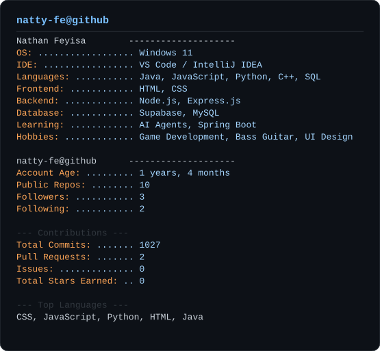

  

## ✦ About Me

▹ CS grad from American College of Technology, 2025.
▹ Built a bilingual marketplace platform, a role-based academic advising system, and I'm still working on an e-commerce site.
▹ Comfortable across the stack: REST APIs, auth, databases, front-end.
▹ Pick things up fast in a new codebase, don't need much hand-holding.
▹ Ask me about Node/Express APIs, JWT auth, Postgres/Supabase, or RAG pipelines.

## ✦ Connect

## ✦ Tech Stack

**Languages**

**Backend & APIs**

**Databases**

**Tools**

## ✦ GitHub Stats

## ✦ Trophies

## ✦ Activity Graph

## ✦ Live Stat Card

  <picture>
    <source media="(prefers-color-scheme: dark)" srcset="./dark_mode.svg">
    <source media="(prefers-color-scheme: light)" srcset="./light_mode.svg">
    
  </picture>

## ✦ Featured Projects

| | |
|---|---|
| **[GULIT — Bilingual Market Price Management System](https://github.com/natty-fe/Gulit.github.io)** Digitizes a paper-based traditional market: regulated pricing, approved-shop listings, order tracking, delivery workflows. Node.js/Express REST API in MVC style, 5 user roles with role-based auth, JWT + bcrypt, transactional email via Resend, PostgreSQL/Supabase. `JavaScript` | **[Student Academic Advisor System](https://github.com/natty-fe/Student_service.github.io)** Tracks completed/planned courses, estimates GPA, checks prerequisite readiness. Course recommendation engine, graduation-eligibility prediction, and a local chat assistant for GPA/requirement questions. `JavaScript` |
| **[AI Study Assistant](https://github.com/natty-fe/AI-study-assistance)** RAG-based study tool: FastAPI backend, JWT auth, Postgres, MinIO for uploaded files. Celery + Redis pipeline for chunking and embeddings, hybrid retrieval (Pinecone + BM25). GPT-4o for chat, summaries, quizzes, flashcards. `Python` | **Bazar — E-commerce Marketplace** *(in progress)* Full-stack marketplace: product browsing, cart, order flow. `JavaScript` |

## ✦ Contribution Snake

